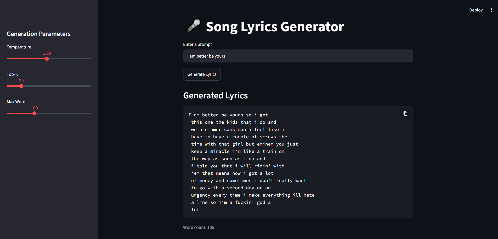

# 🎤 Song Lyrics Generator

## Project Overview
This project generates original song lyrics using two different neural network architectures:
- **LSTM Model** - Fast and reliable word-level generation
- **Transformer Model** - Advanced architecture with self-attention mechanism

Both models are trained on diverse song lyrics and can be selected from the web interface. Choose between speed (LSTM) and advanced features (Transformer) for your lyrics generation needs.

## 🎯 Features

- **Dual Model Support** - Switch between LSTM and Transformer models
- **Interactive Web Interface** - Built with Streamlit for easy use
- **Customizable Parameters** - Control temperature, top-K sampling, and word count
- **GPU Acceleration** - Automatic GPU detection and utilization
- **Word-Level Generation** - Generates realistic song lyrics word-by-word
- **Model Comparison** - Compare outputs from both architectures

# Screenshots



## Model Architecture

### LSTM Model

| Hyperparameter | Value |
|---|---|
| Vocabulary Size | 4,981 |
| Embedding Dimension | 128 |
| Hidden Dimension | 512 |
| LSTM Layers | 2 |
| Dropout | 0.2 |
| Sequence Length | 20 |
| Total Parameters | ~8.7M |

### Transformer Model

| Hyperparameter | Value |
|---|---|
| Vocabulary Size | 4,981 |
| Model Dimension (d_model) | 128 |
| Number of Heads | 4 |
| Feedforward Dimension | 1024 |
| Transformer Layers | 2 |
| Dropout | 0.2 |
| Max Sequence Length | 512 |
| Positional Encoding | Sine/Cosine |

## Installation

```bash
git clone https://github.com/Prat-2005/song-lyrics-generator.git
cd song-lyrics-generator
pip install -r requirements.txt
```

## Running Locally

```bash
streamlit run app.py
```

The app will open at `http://localhost:8501` with a model selector in the sidebar.

## Usage

1. **Select Model** - Choose LSTM or Transformer from the sidebar radio button
2. **Enter Prompt** - Type a lyrics prompt (e.g., "love is", "i am", "you better")
3. **Adjust Parameters**:
   - **Max Words** - Control generated text length (80-500)
   - **Temperature** - Higher = more creative (0.5-2.0)
   - **Top-K** - Limit sampling to top K tokens (5-50)
4. **Generate** - Click "Generate Lyrics" button
5. **Compare** - Switch models to compare outputs for the same prompt

## Example Outputs

**Prompt:** `love is` 
> love is it out it get up go to get a little bit and i'm a man and a laugh like a punch at your neck and hit your ass and i don't know what to do this and i'll be livin' at me and let me bust the shit out the time i don't wanna see what i say i just want a lot i don't wanna seem to play but i ain't playin' i got a rhyme that i don't know what you say i'm just fed up i've been on my dick but i don't need no one i'm 'bout to be a father if i was just checking the same it's got a woman and a laugh just a couple of months and metaphors attached to my damn friend of mine and a place and smack a million bucks i'd get a list in the world

**Prompt:** `i am` 
> i am no matter oh shit it's too mainstream and it's cold it's ridiculous he says but i'm going for that static that i was done with all i just do is murder hands through my head so i didn't feel so much more as a white life you can get ourselves off of this bitch and i got a breath and a sexy father i'ma make a whole damn life and i can't figure out which spice eminem i want to make a new wallet like a fat butt and make the beat down and turn off and make 'em all i do is number the way that i do is number time that you did i never want i think of a girl and i don't really got shit in my eyes but what would you do how to do

**Prompt:** `you better` 
> you better stop using your hands on me, i'm victim of physical abuse by my fiance you drifting by nature stop hella body pick me knockin' stopping on this hoe bitch stop tryin' get flames down too long night a name on me but you you dropping you see another time time is steady devils thought

## Project Structure

```
song-lyrics-generator/
├── models/
│   ├── lyrics_lstm_checkpoint.pth
│   └── best_transformer_model.pth
├── src/
│   ├── model.py              # LSTM & Transformer architectures
│   ├── inference.py          # Model loading & generation
│   ├── dataset.py            # Data preprocessing
│   └── utils.py              # Helper functions
├── public/
├── app.py                    # Streamlit web interface
├── requirements.txt
├── PROMPT.md
└── README.md
```

## Model Checkpoints

- **LSTM**: `models/lyrics_lstm_checkpoint.pth`
  - Lighter weight, faster inference
  - Best for real-time generation

- **Transformer**: `models/best_transformer_model.pth`
  - Advanced attention mechanism
  - Better long-range dependencies
  - Typically higher quality outputs

## Training Data

Models trained on lyrics from artists:
- Beyoncé, Dua Lipa, Eminem, Justin Bieber, Taylor Swift, Drake, Nicki Minaj, Coldplay, Billie Eilish

**Total Dataset**: ~4,500 lyrics across 9 artists

## Technologies Used

- **PyTorch** - Deep learning framework
- **Streamlit** - Web interface
- **CUDA** - GPU acceleration
- **Pandas** - Data processing

## Tips for Best Results

1. **Use meaningful prompts** - Start with words that frequently appear in lyrics
2. **Adjust temperature** - Lower (0.5-1.0) for coherent text, higher (1.5-2.0) for creativity
3. **Try both models** - Compare outputs to find your preference
4. **Longer generations** - Use higher max_words for more complete verses

## Future Enhancements

- [ ] Fine-tuning on specific artists
- [ ] Rhyme scheme detection
- [ ] Beam search decoding
- [ ] Real-time streaming generation
- [ ] Multi-artist model fusion

## License

This project is licensed under the MIT License - see the LICENSE file for details.

## Author

Created as a demonstration of modern NLP techniques for creative text generation.